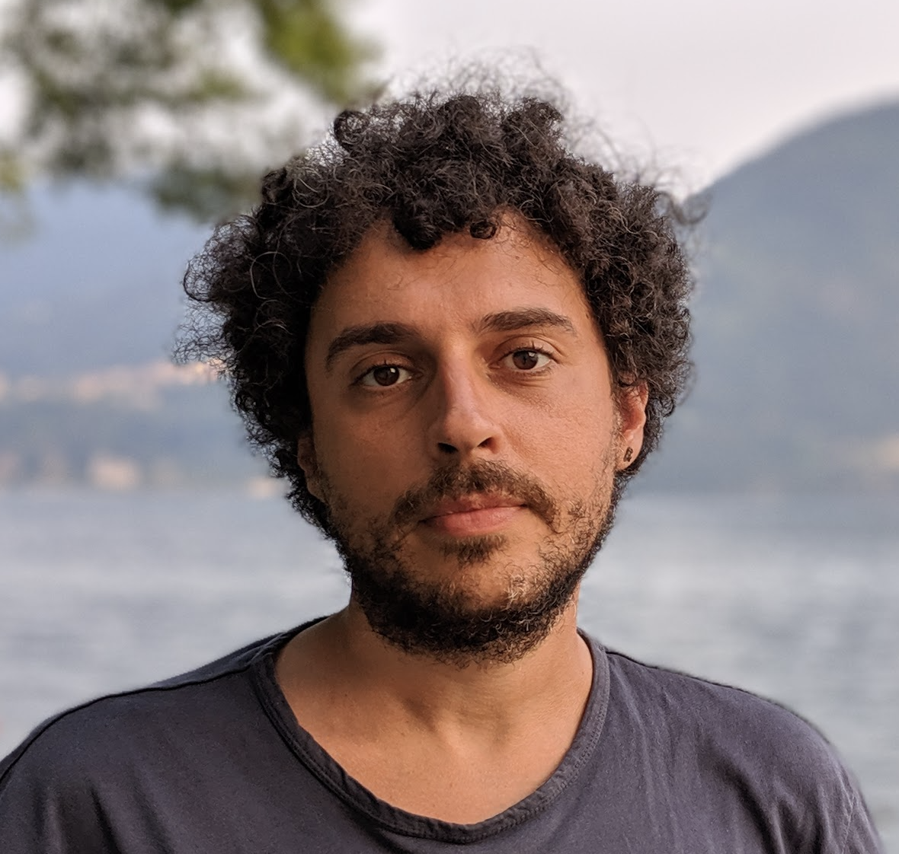

I am an Assistant Professor in the Computer Science department at [VU Amsterdam](https://vu.nl/en/about-vu/faculties/faculty-of-science/departments/computer-science). Previously, I was a Principal Researcher in the Virtual Machine  Research Group at [Oracle Labs](http://labs.oracle.com), and a member of the [GraalVM](https://github.com/graalvm) team.

My research focuses on the intersection of Programming Languages and Systems. I am particularly fascinated by the various ways in which language runtimes can interact with large-scale software systems in areas such as Cloud computing or Data Analytics.

<!-- 
## Research Interest

Lorem ipsum dolor sit amet, consectetur adipiscing elit. Aliquam finibus ipsum ac erat aliquam dapibus. Vestibulum vehicula placerat ex, a consectetur odio pharetra quis. Mauris id urna ante. Fusce pharetra diam ac nisi aliquet, vel egestas ex iaculis. Pellentesque laoreet cursus tellus sed pellentesque. Praesent a rhoncus elit. Nunc ipsum nisl, consequat sit amet pretium quis, gravida id ipsum.

## Publications

1. F.Bar, J.Doe: Effects of having a placeholder of a name
2. S.Holmes, J.Watson: Consequences of living with a sociopath in London

## Typography

This is a [link](http://google.com). Something *italics* and something **bold**.

Here is a table

Year | Award | Category
-----|-------|--------
2014 | Emmy  | Won Outstanding Lead Actor in a miniseries or a movie
2015 | BAFTA | Nominated for Best Leading Actor for Sherlock
2014 | Satellite | Won Best Actor miniseries or television film

Here is a horizontal rule

---

Here is a blockquote

> To a great mind, nothing is little

## References

* Foo Bar: Head of Department, Placeholder Names, Lorem
* John Doe: Associate Professor, Department of Computer Science, Ipsum -->
